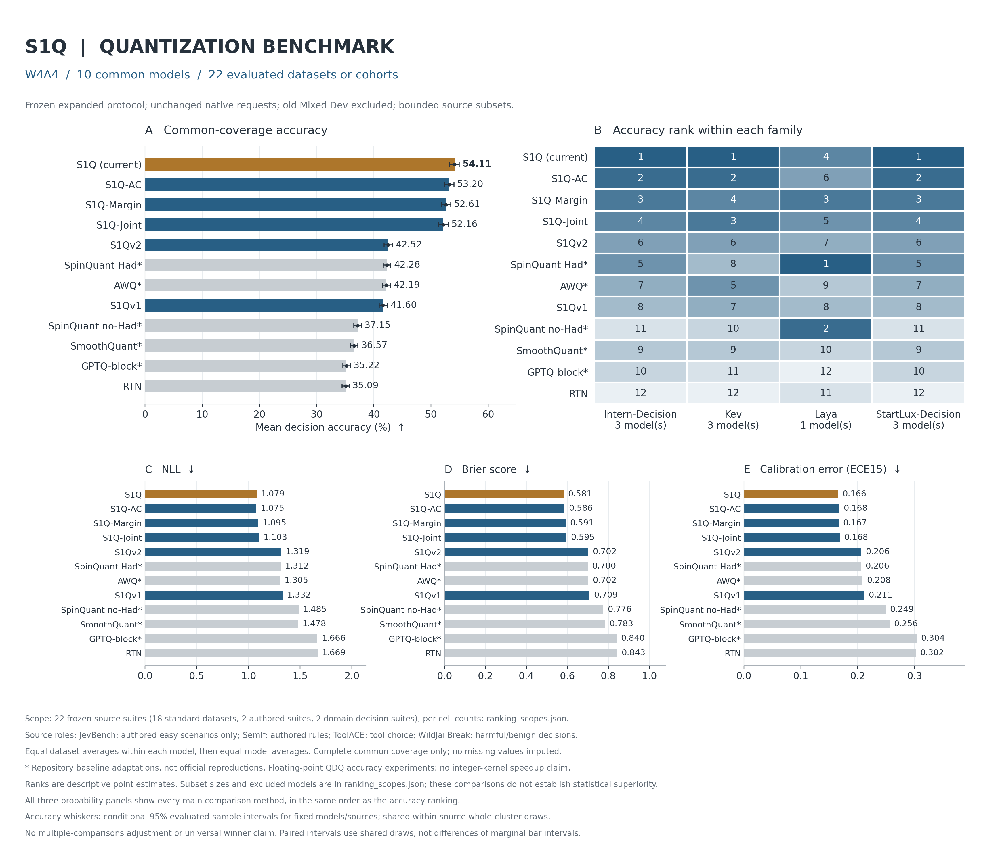
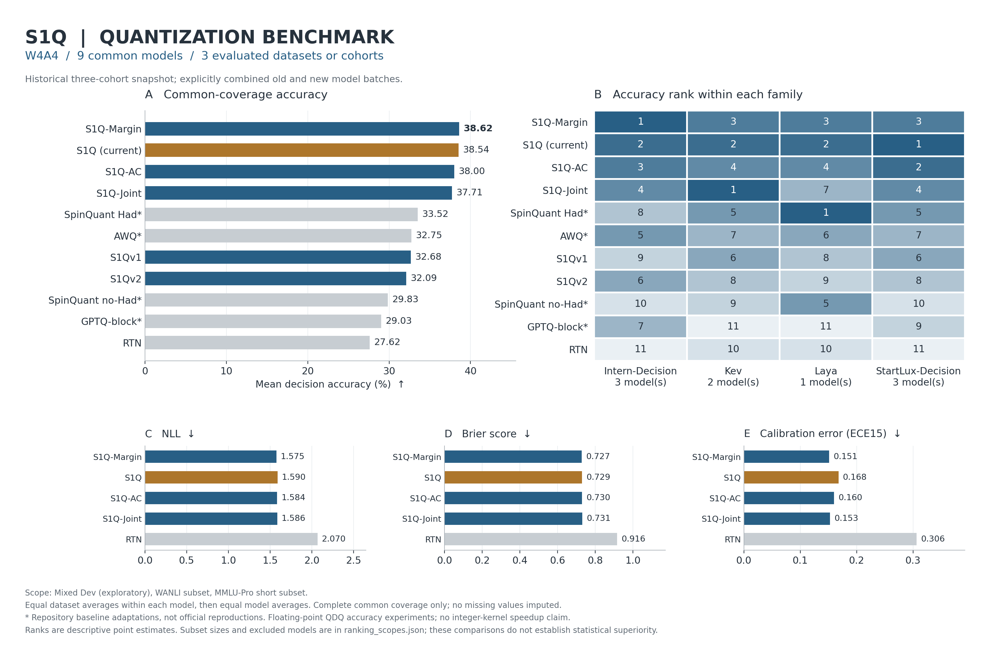

# S1Q：面向 System One 决策模型的低比特量化

[English](README.md) · [方法](docs/method.md) · [最新方法复现](docs/reproduce-current.md) · [扩展评测结果](results/benchmarks/expanded-20261007/README.md) · [扩展评测协议](docs/expanded-benchmarks.md) · [历史聚合结果](results/benchmarks/historical-20261006/README.md) · [相关工作](docs/related-work.md) · [历史结果](docs/results.md) · [权重使用](docs/artifacts.md)

**最新方法统一称为 S1Q。** 2026 年 10 月批次里的 `s1q-mac` 是历史实验标识，继续兼容用于复现；公开名称不改为 S1Q-MAC。旧 S1Q 与 S1Q2 作为历史对照保留。

S1Q 面向 Kev、NanoJev、Laya、Intern-Decision 和 StartLux-Decision 等开源 Jev-like / System One 决策模型。新增两家族各支持 0.8B、2B、4B，使用文本原生接口，并分别验证原生输出与校准梯度；适配器注册与完成评测是独立状态，详见 [模型扩展说明](docs/decision-model-extensions.md)。这类模型根据状态和有类型的问题直接输出有限候选项的分数或概率，因此评测既关注准确率，也关注决策翻转、概率漂移和置信度质量。

最新 S1Q 用无标签校准实现三个步骤：分别计算原精度模型第一名与第二名候选的分数差梯度，按有界 token 敏感度采样；用实际 W/A 量化后的层输出误差联合选择通道缩放与裁剪；在权重量化前，用有界岭回归修正激活量化误差，并在另一半 token 储存池上选择修正或不修正候选。

**敏感度是 margin-Jacobian 的 token 代理，不是完整 Fisher 矩阵。** [GuidedQuant](https://proceedings.mlr.press/v267/kim25d.html) 已用最终损失梯度指导量化重构，[RSQ](https://openreview.net/pdf?id=kBezrKXHVS) 已利用重要 token 改进量化。岭回归补偿与 [ERQ（ICML 2024）](https://proceedings.mlr.press/v235/zhong24a.html) 直接相关，原精度输出匹配与 [GPTAQ](https://arxiv.org/abs/2504.02692) 也有相关性。梯度引导、token 重要性、缩放、裁剪与补偿各自都不是新发明；目前研究的是这些机制在原生有类型决策模型中的具体结合与效果。[方法文档](docs/method.md) 给出实现一致的公式和局限。

## 10 月 7 日扩展评测结果

**已完成：10 个文本决策模型 × 22 个来源套件 × 12 种量化方法，统一 W4A4，另列 Native 参考行。** 按冻结来源范围核验，每个模型实际准入均为 **2,565 个请求、2,871 个决策**。模型包括 Kev-0.8B/4B/9B、Laya、Intern-Decision-0.8B/2B/4B 和 StartLux-Decision-0.8B/2B/4B；**本轮新矩阵不含 Kev-27B、NanoJev**。先对每模型的 22 个来源等权平均，再对 10 个模型等权平均，不按决策总数混池计算。

在本轮 12 个实现中，**最新 S1Q 的准确率、Brier 和 ECE15 排名第一**，S1Q-AC 的 NLL 最低。S1Q 准确率 **54.11%**，RTN 为 35.09%，提高 **19.01 个百分点**。Native 为 76.38%，仍有 **22.27 个百分点的准确率损失**，因此不能称为无损量化。这个结论只针对本轮固定范围，不代表超过官方量化实现或在每个模型、数据集上都最好。

| 准确率排名 | 方法 | 准确率 % ↑ | NLL ↓ | Brier ↓ | ECE15 ↓ |
| ---: | --- | ---: | ---: | ---: | ---: |
| — | Native 参考 | 76.38 | 0.734 | 0.345 | 0.131 |
| 1 | S1Q（最新） | **54.11** | 1.079 | **0.581** | **0.166** |
| 2 | S1Q-AC | 53.20 | **1.075** | 0.586 | 0.168 |
| 3 | S1Q-Margin | 52.61 | 1.095 | 0.591 | 0.167 |
| 4 | S1Q-Joint | 52.16 | 1.103 | 0.595 | 0.168 |
| 5 | S1Qv2 | 42.52 | 1.319 | 0.702 | 0.206 |
| 6 | SpinQuant Had* | 42.28 | 1.312 | 0.700 | 0.206 |
| 7 | AWQ* | 42.19 | 1.305 | 0.702 | 0.208 |
| 8 | S1Qv1 | 41.60 | 1.332 | 0.709 | 0.211 |
| 9 | SpinQuant no-Had* | 37.15 | 1.485 | 0.776 | 0.249 |
| 10 | SmoothQuant* | 36.57 | 1.478 | 0.783 | 0.256 |
| 11 | GPTQ-block* | 35.22 | 1.666 | 0.840 | 0.304 |
| 12 | RTN | 35.09 | 1.669 | 0.843 | 0.302 |

最佳量化数值及显示精度上的并列值加粗，Native 不参与量化方法排名。[各指标完整排名与配对差异](docs/expanded-benchmarks.md#completed-expanded-comparison) · [每模型/来源准确率表](results/benchmarks/expanded-20261007/accuracy_table.md) · [未舍入排名 CSV](results/benchmarks/expanded-20261007/rankings.csv)。

共享 cluster 抽样的条件配对 95% 区间为：当前 S1Q 相对 RTN **+19.014 [18.010, 19.998] pp**，相对 S1Q-AC **+0.909 [0.253, 1.614] pp**，相对 S1Q-Margin **+1.495 [0.811, 2.217] pp**。这三组区间在固定已评样本协议下不包含零；未作多重比较修正，不能据此宣称普遍冠军。[区间证据](results/benchmarks/expanded-20261007/accuracy-uncertainty/accuracy_uncertainty.md) · [区间复现命令](docs/expanded-benchmarks.md#conditional-accuracy-intervals)。



[矢量图](results/benchmarks/expanded-20261007/benchmark_ranking.svg) · [图的来源清单](results/benchmarks/expanded-20261007/figure_manifest.json) · [聚合报告](results/benchmarks/expanded-20261007/README.md) · [补充类别诊断](results/benchmarks/expanded-20261007/classification-diagnostics/classification_diagnostics.md)。

另有 [来源细分 CSV（6,240 行）](results/benchmarks/expanded-20261007/metrics_by_source.csv)、[逐评测组配对比较 CSV（34,080 行）](results/benchmarks/expanded-20261007/paired_by_cohort.csv) 及 [哈希与解释清单](results/benchmarks/expanded-20261007/supplemental_table_manifest.json)。任务子类型不是额外数据集，旧开发集细分仍不进入主排名。逐评测组区间使用 seed 20261004，与固定 22 来源全局区间的 seed 20261007 及估计量不同。[Native 控制组一致性检查](results/benchmarks/expanded-20261007/audits/native-control-evidence.json) · [220 个 Native/来源单元审计](results/benchmarks/expanded-20261007/audits/native-source-binding-10models.json)。

22 个来源都是经过筛选的短请求子集，并非完整上游排行榜评测，包括 18 个标准数据集来源、2 个人工规则/情景套件和 2 个领域决策套件。JevBench 仅纳入 48 个新的 easy 任务；ToolACE 评测工具选择，WildJailBreak 评测有害/无害分类。Typed Decisions 因 teacher 标签和长度限制未纳入。准备过程保留原题与候选项，排除记录的校准和已有评测身份，旧 Mixed Dev 不进入新平均分。四个已审计语义分类来源的 520 个补充诊断单元用于解释类别不平衡，不改主榜。详见[来源、筛选与候选顺序契约的局限](docs/expanded-benchmarks.md)。

原 11 方法运行与独立 SmoothQuant* 控制通过 Native 等价性和范围检查后才合并，原始两次运行均保留。带 * 的 SmoothQuant、AWQ、GPTQ-block、SpinQuant 是本项目适配版或代理。准确率使用浮点 QDQ；本轮未验证整数内核加速或打包完整模型的压缩收益。StartLux 使用已记录的 `STARTLUX_ALLOW_SLOW=1` 参考运行方式。

## 历史三评测组结果

[10 月 6 日历史聚合结果](results/benchmarks/historical-20261006/README.md)保留 **537 条已完成的聚合指标**，分别来自原优化批次的 321 条和六个 Intern-Decision / StartLux-Decision 模型的 216 条。提供[指标 CSV](results/benchmarks/historical-20261006/metrics.csv)、[JSON](results/benchmarks/historical-20261006/metrics.json)、[分范围排名](results/benchmarks/historical-20261006/rankings.csv)、[覆盖与样本数](results/benchmarks/historical-20261006/ranking_scopes.json)及[来源哈希](results/benchmarks/historical-20261006/provenance.json)。8 个范围分别记录精度、模型覆盖和评测组；历史主榜保持实际测过的 11 种方法，不补入未测的 SmoothQuant。

下图展示的是 **历史 W4A4 三评测组结果**，比较 11 种方法共同完成的 9 个模型，与新增 22 来源协议分开列示，不混合两个平均分。[矢量图](results/benchmarks/historical-20261006/benchmark_ranking.svg) · [图的来源清单](results/benchmarks/historical-20261006/figure_manifest.json)。



## 原冻结批次的代表性结果

10 月 4 日冻结批次包含五个模型的 W4A4，以及 Kev-0.8B / Kev-4B 的 W3A4 实验。W4A4 上 Kev-4B 的 S1Q 准确率为 76.85%，旧 S1Q2 为 55.63%；Kev-9B 对应 71.70% 与 41.48%。但 Kev-0.8B 的 W4A4 从旧 S1Q2 的 63.99% 降到 61.41%。这些都是已经检查过的开发集结果，不能宣称在所有模型、指标和数据集上最好。完整代表性数字及数据含义见 [英文说明](README.md#current-evidence)。

文本开发集包含 311 个决策；NanoJev 包含 255 个记录的参考策略动作兼容性决策，其准确率不是游戏成功率。WANLI 与 MMLU-Pro 是额外评测；Kev-27B 仅完成小规模无梯度 pilot，尚未完整评测最新 S1Q。AWQ、GPTQ、SpinQuant 对照是本项目适配版或代理，不是官方精确复现；SmoothQuant 未运行本批次，不能混入这批排名。

目前 W/A 实验采用浮点 QDQ，矩阵乘法仍是浮点，**不能描述成原生 INT4 内核加速**。权重可以导出成实际打包线性层文件，但不含完整模型、原生头、分词器和保留参数；本批次没有导出最新方法的完整模型或验证其整数内核加速。决策头、embedding、归一化与非 Linear 递归计算保持原精度。最新 S1Q 计算梯度用于敏感度统计，不训练模型参数；可选 gain-repair 是另一个有优化步骤的对照，不属于最终方法。

安装环境、准备数据之后运行：

```bash
s1q optimize --model kev-4b --data-dir work/data/shared \
  --output-dir work/runs/kev4-s1q-w4a4 \
  --methods s1q,rtn,s1q-local,s1q2-beta05,awq-adapted \
  --bits 4 --activation-bits 4 --group-size 128 \
  --calibration-count 128 --development-count 256 \
  --reservoir-size 128 --seed 20261004
```

默认 `s1q optimize` 比较最新 S1Q 与 RTN；`s1q run` 保留旧 v0.1 工作流。运行前冻结配置，量化不使用金标准标签，额外评测集不进入校准，保存输入/代码哈希与原精度固定资格名单。校准池的 fit/select 分开的是 token 行，来自同一批请求，并非独立请求验证集。详见 [复现说明](docs/reproduce-current.md)。

已有 [v0.1.0 权重发布](https://github.com/CYMCharming/S1Q/releases/tag/v0.1.0)与结果属于历史版本。论文继续保持私有；公开评测图由聚合指标生成，不重新分发新模型权重、原始数据或原始预测。已有 Laya/Kev 社区量化工作，因此不声称首个针对 System One 的量化。

感谢 [TypeSafe Jev](https://docs.typesafe.ai/introduction)、[Kev](https://github.com/jaredpalmer/kev)、[NanoJev](https://github.com/TianyuCodings/NanoJev) 和 [Laya](https://github.com/NandhaKishorM/laya) 的作者。项目由 [CYMCharming](https://github.com/CYMCharming) 维护，与 TypeSafe 无隶属关系；源代码、权重和数据各自保留原始许可。引用时请固定准确 commit 或 release，参见 [CITATION.cff](CITATION.cff)。
