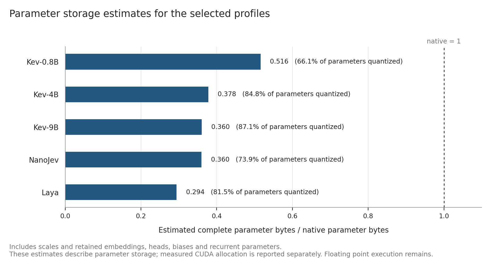
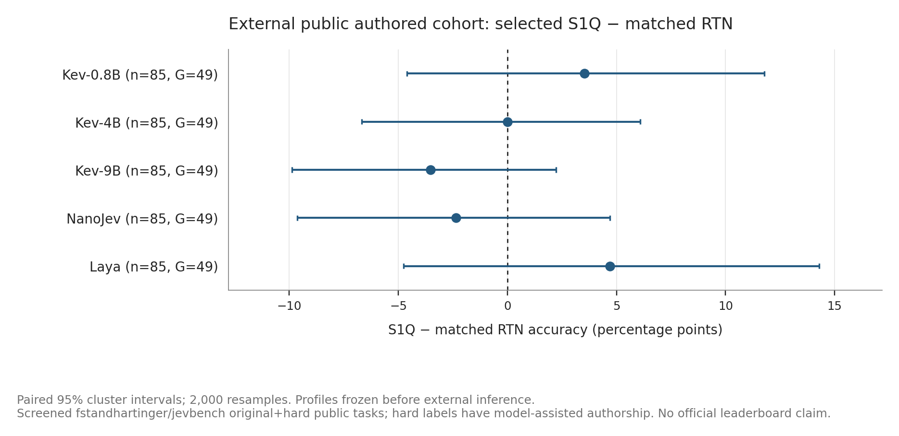

# S1Q paper figures

Generated by `scripts/plot_results.py` from `results/aggregate.json`. The exact aggregate hash, selected runs, displayed values and export hashes are in `figure-manifest.json`. SVG files retain editable text; PDF files embed the default sans serif font. PNG files are inspection previews.

## Paired accuracy differences: main versus source transfer/native game OOD


[SVG](paired_accuracy.svg) · [PDF](paired_accuracy.pdf)

Exploratory paired changes; no significance annotations or pooled cross-model rate.

## Complete parameter storage estimates



[SVG](parameter_storage.svg) · [PDF](parameter_storage.pdf)

Parameter estimate only; no measured memory or speedup inference.

## Fixed-profile external authored validation



[SVG](external_accuracy.svg) · [PDF](external_accuracy.pdf)

Fixed-profile external authored validation; no invented uncompleted model points.

The paired intervals are computed from saved paired predictions using saved cluster IDs. Older files without them use record-ID clusters, as recorded in the figure manifest. Models and datasets have different target semantics and sample sizes; their rates are never pooled. The expanded search followed inspected pilot results. Storage ratios include retained native parameters and are separate from measured CUDA allocation. The runtime uses transient dequantization and floating point matrix multiplication; these figures imply no native integer speedup.

```sh
python scripts/summarize_results.py
python scripts/plot_results.py --input results/aggregate.json --output-dir docs/assets
```
