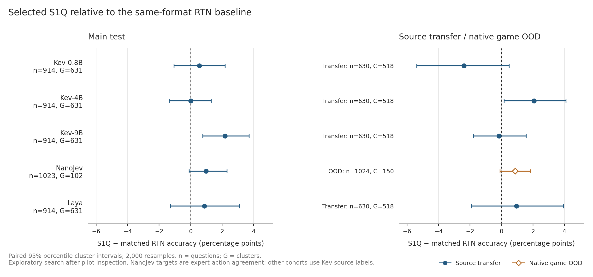

# S1Q experimental results

Generated from completed, hashed run summaries and saved paired predictions by `scripts/summarize_results.py`. Only `status=complete` runs are included. Values below describe this research snapshot; pending runs are not counted.

Pilot results were inspected before the expanded Fisher search. Pilot and expanded validation results are exploratory, including repeated evaluation on overlapping Kev suites. A larger rerun does not create a new independent held-out set. External authored-cohort results are reported separately when available; they must use profiles frozen before external inference.

The current implementation rounds weights and simulates activation quantization while executing floating point operations. Storage estimates include retained embeddings, heads and other native parameters; they are not GPU memory or integer-kernel speedups. NanoJev game targets measure agreement with explicit expert actions, rather than calibration of observed event probabilities. No claim of the first quantization work on these models follows from these experiments.

## Latest completed main cohorts

Accuracy is a percentage; differences and interval endpoints are percentage points. Each interval is a paired percentile cluster bootstrap with 2,000 resamples and seed `20261001`. Intervals are descriptive, not adjusted for multiple comparisons. Matched RTN uses identical protected tensor identities, weight format/group size, activation scheme and parameter coverage. Different models/cohorts can have different labels and sample counts; do not pool them into one accuracy.

| Model | Run | Questions | Native % | Matched RTN % | Selected S1Q % | S1Q−RTN pp [95% CI] | S1Q−native pp [95% CI] |
| --- | --- | --- | --- | --- | --- | --- | --- |
| kev-0.8b | kev-0.8b-validation-v2 | 914 | 82.93 | 80.63 | 81.18 | +0.55 [-1.07, +2.18] | -1.75 [-3.06, -0.45] |
| kev-4b | kev-4b-validation-v2 | 914 | 85.45 | 84.79 | 84.79 | +0.00 [-1.36, +1.30] | -0.66 [-1.76, +0.43] |
| kev-9b | kev-9b-validation-v2 | 914 | 86.98 | 84.35 | 86.54 | +2.19 [+0.76, +3.71] | -0.44 [-1.44, +0.55] |
| nanojev | nanojev-validation-v2 | 1023 | 79.86 | 79.47 | 80.45 | +0.98 [-0.11, +2.31] | +0.59 [-0.30, +1.48] |
| laya | laya-validation-v2 | 914 | 66.85 | 63.68 | 64.55 | +0.88 [-1.27, +3.10] | -2.30 [-4.25, -0.23] |

4 of 5 latest main S1Q−matched-RTN intervals include zero; the inspected search does not support a universal improvement claim. Selected main accuracy loses more than one percentage point against the unquantized checkpoint for kev-0.8b (-1.75 pp), laya (-2.30 pp). Raw main NLL is worse than matched RTN for kev-0.8b, kev-4b, kev-9b, laya; better decision fidelity or accuracy does not guarantee better raw probability metrics. Source-transfer point accuracy is lower than matched RTN for kev-0.8b (-2.38 pp), kev-9b (-0.16 pp); intervals remain visible in the transfer table. The development objective selects a Fisher profile for 1 of 5 models with completed Fisher searches; this is not evidence of a general Fisher benefit. Simulated 4-bit activation candidates lose development accuracy against native for kev-0.8b, kev-4b, kev-9b, nanojev, laya.

## Paper figures

- Main and transfer/game OOD paired accuracy differences: [SVG](assets/paired_accuracy.svg) · [PDF](assets/paired_accuracy.pdf)
- External authored-cohort paired accuracy differences: [SVG](assets/external_accuracy.svg) · [PDF](assets/external_accuracy.pdf)
- Complete parameter storage estimates: [SVG](assets/parameter_storage.svg) · [PDF](assets/parameter_storage.pdf)



Exports and plotted values are bound to this report's aggregate by [the figure manifest](assets/figure-manifest.json). See [all figure previews and reproduction instructions](assets/README.md).

## Source-transfer cohorts

| Model | Run | Questions | Native % | Matched RTN % | Selected S1Q % | S1Q−RTN pp [95% CI] | S1Q−native pp [95% CI] |
| --- | --- | --- | --- | --- | --- | --- | --- |
| kev-0.8b | kev-0.8b-validation-v2 | 630 | 68.25 | 68.25 | 65.87 | -2.38 [-5.38, +0.48] | -2.38 [-5.10, +0.31] |
| kev-4b | kev-4b-validation-v2 | 630 | 83.97 | 83.17 | 85.24 | +2.06 [+0.16, +4.10] | +1.27 [-0.80, +3.42] |
| kev-9b | kev-9b-validation-v2 | 630 | 85.24 | 84.44 | 84.29 | -0.16 [-1.79, +1.57] | -0.95 [-2.29, +0.32] |
| laya | laya-validation-v2 | 630 | 66.03 | 65.87 | 66.83 | +0.95 [-1.93, +3.93] | +0.79 [-1.76, +3.48] |

## Native game OOD cohort

| Model | Run | Questions | Native % | Matched RTN % | Selected S1Q % | S1Q−RTN pp [95% CI] | S1Q−native pp [95% CI] |
| --- | --- | --- | --- | --- | --- | --- | --- |
| nanojev | nanojev-validation-v2 | 1024 | 77.44 | 76.95 | 77.83 | +0.88 [-0.09, +1.86] | +0.39 [-0.36, +1.15] |

## External authored confirmation

JevBench refers specifically to `fstandhartinger/jevbench` at the pinned source commit in the data configuration. The short original+hard cohort admits 85 public tasks in 49 scenario clusters before tokenizer admission and excludes 98 hard tasks for length. Hard labels have model-assisted authorship and cross-review. This screened public cohort is not the full official benchmark or a leaderboard rank.

| Model | Run | Questions | Native % | Matched RTN % | Selected S1Q % | S1Q−RTN pp [95% CI] | S1Q−native pp [95% CI] |
| --- | --- | --- | --- | --- | --- | --- | --- |
| kev-0.8b | kev-0.8b-external-v2 | 85 | 76.47 | 72.94 | 76.47 | +3.53 [-4.60, +11.77] | +0.00 [-6.67, +6.42] |
| kev-4b | kev-4b-external-v2 | 85 | 88.24 | 84.71 | 84.71 | +0.00 [-6.67, +6.10] | -3.53 [-9.09, +1.18] |
| kev-9b | kev-9b-external-v2 | 85 | 83.53 | 88.24 | 84.71 | -3.53 [-9.88, +2.22] | +1.18 [+0.00, +3.70] |
| nanojev | nanojev-external-v2 | 85 | 40.00 | 41.18 | 38.82 | -2.35 [-9.64, +4.71] | -1.18 [-3.70, +0.00] |
| laya | laya-external-v2 | 85 | 64.71 | 61.18 | 65.88 | +4.71 [-4.76, +14.29] | +1.18 [-9.30, +11.76] |

5 of 5 external S1Q−matched-RTN accuracy intervals include zero. The point estimates include gains, ties and losses; this small authored cohort does not establish a consistent improvement across models. NanoJev's unquantized game checkpoint already scores 40.00% on these general authored decisions; selected S1Q scores 38.82%, a -1.18 pp change. The low absolute baseline is consistent with a domain-transfer limitation before quantization; the paired change measures the additional quantizer effect.

## Selected profiles and parameter storage

| Model | Selected profile | Format / activations | Quantized params % | Native MiB | Estimated complete packed MiB | Storage ratio | Matched RTN |
| --- | --- | --- | --- | --- | --- | --- | --- |
| kev-0.8b | s1q-fisher | W4, group 128; native | 66.09 | 1437.078 | 741.119 | 0.516 | rtn |
| kev-4b | s1q-local | W4, group 128; native | 84.84 | 8026.836 | 3031.000 | 0.378 | rtn |
| kev-9b | s1q-a8 | W4, group 128; 8-bit QDQ | 87.15 | 15146.026 | 5460.089 | 0.360 | rtn-matched |
| nanojev | s1q-local | W4, group 128; native | 73.86 | 2274.515 | 818.734 | 0.360 | rtn |
| laya | s1q-local | W4, group 128; native | 81.45 | 1607.108 | 472.623 | 0.294 | rtn |

## Measured packed execution

These are completed device measurements, reported separately from the parameter estimates above. Persistent and peak values use PyTorch allocated CUDA memory. The packed path dequantizes one layer at a time and still executes floating point GEMM. Mean request time includes encoding; the benchmark has no paired dense latency measurement and supports no speedup claim. Parity compares dense and packed execution reconstructed from the same quantized artifact on the same small subset.

| Model | Run | Scored decisions | Dense persistent MiB | Packed persistent MiB | Packed peak MiB | Packed mean request ms | JS to same artifact | Decision flips % |
| --- | --- | --- | --- | --- | --- | --- | --- | --- |
| kev-0.8b | kev-0.8b-validation-v2 | 41 | 1469.225 | 760.516 | 880.962 | 78.656 | 0 | 0.00 |
| kev-4b | kev-4b-validation-v2 | 41 | 8130.988 | 3123.027 | 3503.789 | 201.561 | 0 | 0.00 |
| kev-9b | kev-9b-validation-v2 | 41 | 15154.179 | 5488.116 | 6107.078 | 336.986 | 0 | 0.00 |
| laya | laya-validation-v2 | 41 | 1616.483 | 495.129 | 551.790 | 59.534 | 0 | 0.00 |
| nanojev | nanojev-validation-v2 | 32 | 2284.392 | 832.236 | 946.817 | 67.192 | 0 | 0.00 |

## Raw and temperature-calibrated metrics

For the main experiments each method fits its own positive per-type temperature on the separate temperature-calibration partition, then uses it unchanged here. External evaluation reuses those frozen temperatures; an unavailable matched RTN temperature is not invented or fitted externally. Raw metrics use unscaled decision logits, normalized into the common candidate distribution (including `[false, true]` for binary questions). Here native means the unquantized checkpoint under that evaluation convention. Published served temperatures and output rounding are not applied in the raw table. Temperature fitting is available to native, RTN and S1Q alike; it cannot change argmax accuracy. NLL/Brier/ECE describe the declared target labels in these datasets, without a real-world probability guarantee. `results/metrics.csv` retains every completed method and cohort, including nonselected local ablations.

### Main

| Model | Method | Stage | Questions | Accuracy % | Macro source % | NLL | Brier | ECE15 |
| --- | --- | --- | --- | --- | --- | --- | --- | --- |
| kev-0.8b | native | raw | 914 | 82.93 | 83.82 | 0.631 | 0.276 | 0.107 |
| kev-0.8b | native | temperature | 914 | 82.93 | 83.82 | 0.475 | 0.253 | 0.035 |
| kev-0.8b | rtn | raw | 914 | 80.63 | 81.54 | 0.642 | 0.302 | 0.119 |
| kev-0.8b | rtn | temperature | 914 | 80.63 | 81.54 | 0.527 | 0.283 | 0.025 |
| kev-0.8b | s1q-fisher | raw | 914 | 81.18 | 82.24 | 0.684 | 0.295 | 0.121 |
| kev-0.8b | s1q-fisher | temperature | 914 | 81.18 | 82.24 | 0.500 | 0.271 | 0.029 |
| kev-4b | native | raw | 914 | 85.45 | 85.93 | 0.530 | 0.226 | 0.091 |
| kev-4b | native | temperature | 914 | 85.45 | 85.93 | 0.374 | 0.199 | 0.034 |
| kev-4b | rtn | raw | 914 | 84.79 | 85.62 | 0.544 | 0.231 | 0.088 |
| kev-4b | rtn | temperature | 914 | 84.79 | 85.62 | 0.403 | 0.212 | 0.020 |
| kev-4b | s1q-local | raw | 914 | 84.79 | 85.12 | 0.560 | 0.241 | 0.098 |
| kev-4b | s1q-local | temperature | 914 | 84.79 | 85.12 | 0.390 | 0.211 | 0.026 |
| kev-9b | native | raw | 914 | 86.98 | 87.86 | 0.500 | 0.210 | 0.079 |
| kev-9b | native | temperature | 914 | 86.98 | 87.86 | 0.369 | 0.192 | 0.039 |
| kev-9b | rtn-matched | raw | 914 | 84.35 | 85.12 | 0.533 | 0.230 | 0.091 |
| kev-9b | rtn-matched | temperature | 914 | 84.35 | 85.12 | 0.409 | 0.214 | 0.030 |
| kev-9b | s1q-a8 | raw | 914 | 86.54 | 87.56 | 0.535 | 0.221 | 0.080 |
| kev-9b | s1q-a8 | temperature | 914 | 86.54 | 87.56 | 0.383 | 0.203 | 0.017 |
| nanojev | native | raw | 1023 | 79.86 | 79.86 | 0.547 | 0.279 | 0.077 |
| nanojev | native | temperature | 1023 | 79.86 | 79.86 | 0.534 | 0.282 | 0.051 |
| nanojev | rtn | raw | 1023 | 79.47 | 79.47 | 0.561 | 0.283 | 0.060 |
| nanojev | rtn | temperature | 1023 | 79.47 | 79.47 | 0.537 | 0.284 | 0.043 |
| nanojev | s1q-local | raw | 1023 | 80.45 | 80.45 | 0.543 | 0.278 | 0.057 |
| nanojev | s1q-local | temperature | 1023 | 80.45 | 80.45 | 0.532 | 0.281 | 0.060 |
| laya | native | raw | 914 | 66.85 | 63.67 | 1.442 | 0.501 | 0.177 |
| laya | native | temperature | 914 | 66.85 | 63.67 | 0.843 | 0.461 | 0.099 |
| laya | rtn | raw | 914 | 63.68 | 59.98 | 1.508 | 0.527 | 0.184 |
| laya | rtn | temperature | 914 | 63.68 | 59.98 | 0.911 | 0.498 | 0.113 |
| laya | s1q-local | raw | 914 | 64.55 | 61.49 | 1.515 | 0.523 | 0.180 |
| laya | s1q-local | temperature | 914 | 64.55 | 61.49 | 0.880 | 0.482 | 0.094 |

### Source transfer

| Model | Method | Stage | Questions | Accuracy % | Macro source % | NLL | Brier | ECE15 |
| --- | --- | --- | --- | --- | --- | --- | --- | --- |
| kev-0.8b | native | raw | 630 | 68.25 | 67.94 | 0.750 | 0.425 | 0.116 |
| kev-0.8b | native | temperature | 630 | 68.25 | 67.94 | 0.720 | 0.425 | 0.088 |
| kev-0.8b | rtn | raw | 630 | 68.25 | 69.11 | 0.767 | 0.429 | 0.100 |
| kev-0.8b | rtn | temperature | 630 | 68.25 | 69.11 | 0.747 | 0.440 | 0.101 |
| kev-0.8b | s1q-fisher | raw | 630 | 65.87 | 64.82 | 0.813 | 0.460 | 0.134 |
| kev-0.8b | s1q-fisher | temperature | 630 | 65.87 | 64.82 | 0.751 | 0.449 | 0.088 |
| kev-4b | native | raw | 630 | 83.97 | 84.98 | 0.575 | 0.243 | 0.084 |
| kev-4b | native | temperature | 630 | 83.97 | 84.98 | 0.424 | 0.231 | 0.038 |
| kev-4b | rtn | raw | 630 | 83.17 | 84.46 | 0.604 | 0.259 | 0.086 |
| kev-4b | rtn | temperature | 630 | 83.17 | 84.46 | 0.456 | 0.248 | 0.052 |
| kev-4b | s1q-local | raw | 630 | 85.24 | 86.60 | 0.538 | 0.231 | 0.073 |
| kev-4b | s1q-local | temperature | 630 | 85.24 | 86.60 | 0.418 | 0.223 | 0.059 |
| kev-9b | native | raw | 630 | 85.24 | 85.64 | 0.572 | 0.239 | 0.094 |
| kev-9b | native | temperature | 630 | 85.24 | 85.64 | 0.443 | 0.232 | 0.068 |
| kev-9b | rtn-matched | raw | 630 | 84.44 | 84.25 | 0.634 | 0.256 | 0.093 |
| kev-9b | rtn-matched | temperature | 630 | 84.44 | 84.25 | 0.486 | 0.258 | 0.069 |
| kev-9b | s1q-a8 | raw | 630 | 84.29 | 84.92 | 0.597 | 0.250 | 0.093 |
| kev-9b | s1q-a8 | temperature | 630 | 84.29 | 84.92 | 0.457 | 0.242 | 0.056 |
| laya | native | raw | 630 | 66.03 | 62.54 | 0.967 | 0.489 | 0.176 |
| laya | native | temperature | 630 | 66.03 | 62.54 | 0.771 | 0.451 | 0.103 |
| laya | rtn | raw | 630 | 65.87 | 61.71 | 0.924 | 0.480 | 0.152 |
| laya | rtn | temperature | 630 | 65.87 | 61.71 | 0.797 | 0.471 | 0.115 |
| laya | s1q-local | raw | 630 | 66.83 | 62.98 | 1.003 | 0.505 | 0.173 |
| laya | s1q-local | temperature | 630 | 66.83 | 62.98 | 0.783 | 0.461 | 0.082 |

### Game OOD

| Model | Method | Stage | Questions | Accuracy % | Macro source % | NLL | Brier | ECE15 |
| --- | --- | --- | --- | --- | --- | --- | --- | --- |
| nanojev | native | raw | 1024 | 77.44 | 77.44 | 0.669 | 0.333 | 0.085 |
| nanojev | native | temperature | 1024 | 77.44 | 77.44 | 0.653 | 0.338 | 0.080 |
| nanojev | rtn | raw | 1024 | 76.95 | 76.95 | 0.677 | 0.332 | 0.084 |
| nanojev | rtn | temperature | 1024 | 76.95 | 76.95 | 0.644 | 0.335 | 0.087 |
| nanojev | s1q-local | raw | 1024 | 77.83 | 77.83 | 0.662 | 0.329 | 0.084 |
| nanojev | s1q-local | temperature | 1024 | 77.83 | 77.83 | 0.647 | 0.334 | 0.077 |

### External authored

| Model | Method | Stage | Questions | Accuracy % | Macro source % | NLL | Brier | ECE15 |
| --- | --- | --- | --- | --- | --- | --- | --- | --- |
| kev-0.8b | native | raw | 85 | 76.47 | 73.28 | 0.634 | 0.353 | 0.109 |
| kev-0.8b | native | temperature | 85 | 76.47 | 73.28 | 0.683 | 0.394 | 0.203 |
| kev-0.8b | rtn-matched | raw | 85 | 72.94 | 70.50 | 0.704 | 0.410 | 0.108 |
| kev-0.8b | rtn-matched | temperature | 85 | 72.94 | 70.50 | 0.751 | 0.446 | 0.211 |
| kev-0.8b | s1q-fisher | raw | 85 | 76.47 | 76.06 | 0.765 | 0.391 | 0.127 |
| kev-0.8b | s1q-fisher | temperature | 85 | 76.47 | 76.06 | 0.713 | 0.414 | 0.189 |
| kev-4b | native | raw | 85 | 88.24 | 85.32 | 0.388 | 0.208 | 0.087 |
| kev-4b | native | temperature | 85 | 88.24 | 85.32 | 0.446 | 0.248 | 0.180 |
| kev-4b | rtn-matched | raw | 85 | 84.71 | 76.98 | 0.393 | 0.225 | 0.086 |
| kev-4b | rtn-matched | temperature | 85 | 84.71 | 76.98 | 0.478 | 0.264 | 0.160 |
| kev-4b | s1q-local | raw | 85 | 84.71 | 79.76 | 0.409 | 0.212 | 0.093 |
| kev-4b | s1q-local | temperature | 85 | 84.71 | 79.76 | 0.438 | 0.242 | 0.110 |
| kev-9b | native | raw | 85 | 83.53 | 76.06 | 0.662 | 0.228 | 0.117 |
| kev-9b | native | temperature | 85 | 83.53 | 76.06 | 0.467 | 0.237 | 0.115 |
| kev-9b | rtn-matched | raw | 85 | 88.24 | 82.54 | 0.700 | 0.223 | 0.114 |
| kev-9b | rtn-matched | temperature | 85 | 88.24 | 82.54 | 0.491 | 0.258 | 0.168 |
| kev-9b | s1q-a8 | raw | 85 | 84.71 | 76.98 | 0.682 | 0.239 | 0.106 |
| kev-9b | s1q-a8 | temperature | 85 | 84.71 | 76.98 | 0.488 | 0.250 | 0.100 |
| nanojev | native | raw | 85 | 40.00 | 36.24 | 1.367 | 0.764 | 0.256 |
| nanojev | native | temperature | 85 | 40.00 | 36.24 | 1.356 | 0.767 | 0.224 |
| nanojev | rtn-matched | raw | 85 | 41.18 | 39.95 | 1.394 | 0.768 | 0.232 |
| nanojev | rtn-matched | temperature | 85 | 41.18 | 39.95 | 1.373 | 0.771 | 0.247 |
| nanojev | s1q-local | raw | 85 | 38.82 | 35.32 | 1.390 | 0.774 | 0.270 |
| nanojev | s1q-local | temperature | 85 | 38.82 | 35.32 | 1.376 | 0.776 | 0.229 |
| laya | native | raw | 85 | 64.71 | 55.69 | 0.988 | 0.547 | 0.211 |
| laya | native | temperature | 85 | 64.71 | 55.69 | 0.878 | 0.510 | 0.141 |
| laya | rtn-matched | raw | 85 | 61.18 | 56.35 | 0.994 | 0.563 | 0.234 |
| laya | rtn-matched | temperature | 85 | 61.18 | 56.35 | 0.957 | 0.551 | 0.173 |
| laya | s1q-local | raw | 85 | 65.88 | 59.39 | 0.975 | 0.518 | 0.214 |
| laya | s1q-local | temperature | 85 | 65.88 | 59.39 | 0.906 | 0.520 | 0.172 |

## Development selection and negative candidates

The selection objective is development boundary-weighted JS divergence to native probabilities plus 0.1 times harmful decision flips; selection is among the declared S1Q candidates. RTN remains a comparator even when its development objective is better. Candidate results are not filtered to favor S1Q. Fisher variants were added after pilot inspection, so their search is exploratory. Fake 4-bit activations must be judged by these measured development results; they do not establish a deployable full W4A4 model.

| Model | Candidate | Selected | Dev accuracy % | Dev objective ↓ | Activation bits | Protected linear fraction % | Fisher |
| --- | --- | --- | --- | --- | --- | --- | --- |
| kev-0.8b | rtn | no | 77.81 | 0.024 | native | 0.00 | no |
| kev-0.8b | s1q-local | no | 80.39 | 0.022 | native | 0.00 | no |
| kev-0.8b | s1q-protected | no | 79.74 | 0.022 | native | 5.00 | no |
| kev-0.8b | s1q-a8 | no | 80.39 | 0.025 | 8 | 0.00 | no |
| kev-0.8b | s1q-a4 | no | 61.41 | 0.160 | 4 | 0.00 | no |
| kev-0.8b | s1q-fisher | yes | 81.67 | 0.021 | native | 0.00 | yes |
| kev-0.8b | s1q-fisher-protected | no | 81.03 | 0.021 | native | 5.00 | yes |
| kev-4b | rtn | no | 85.53 | 0.010 | native | 0.00 | no |
| kev-4b | s1q-local | yes | 84.89 | 0.006 | native | 0.00 | no |
| kev-4b | s1q-protected | no | 84.89 | 0.006 | native | 5.00 | no |
| kev-4b | s1q-a8 | no | 84.57 | 0.006 | 8 | 0.00 | no |
| kev-4b | s1q-a4 | no | 53.70 | 0.238 | 4 | 0.00 | no |
| kev-4b | s1q-fisher | no | 85.21 | 0.008 | native | 0.00 | yes |
| kev-4b | s1q-fisher-protected | no | 85.21 | 0.007 | native | 5.00 | yes |
| kev-9b | rtn | no | 84.57 | 0.015 | native | 0.00 | no |
| kev-9b | s1q-local | no | 85.85 | 0.008 | native | 0.00 | no |
| kev-9b | s1q-protected | no | 86.82 | 0.008 | native | 5.00 | no |
| kev-9b | s1q-a8 | yes | 85.85 | 0.006 | 8 | 0.00 | no |
| kev-9b | s1q-a4 | no | 39.87 | 0.326 | 4 | 0.00 | no |
| kev-9b | s1q-fisher | no | 86.17 | 0.007 | native | 0.00 | yes |
| kev-9b | s1q-fisher-protected | no | 86.17 | 0.007 | native | 5.00 | yes |
| nanojev | rtn | no | 81.96 | 0.002 | native | 0.00 | no |
| nanojev | s1q-local | yes | 81.96 | 0.001 | native | 0.00 | no |
| nanojev | s1q-protected | no | 81.96 | 0.001 | native | 5.00 | no |
| nanojev | s1q-a8 | no | 81.96 | 0.001 | 8 | 0.00 | no |
| nanojev | s1q-a4 | no | 80.78 | 0.013 | 4 | 0.00 | no |
| nanojev | s1q-fisher | no | 82.35 | 0.001 | native | 0.00 | yes |
| nanojev | s1q-fisher-protected | no | 81.96 | 0.001 | native | 5.00 | yes |
| laya | rtn | no | 65.59 | 0.032 | native | 0.00 | no |
| laya | s1q-local | yes | 67.52 | 0.032 | native | 0.00 | no |
| laya | s1q-protected | no | 65.92 | 0.034 | native | 5.00 | no |
| laya | s1q-a8 | no | 67.20 | 0.033 | 8 | 0.00 | no |
| laya | s1q-a4 | no | 53.38 | 0.131 | 4 | 0.00 | no |
| laya | s1q-fisher | no | 64.31 | 0.046 | native | 0.00 | yes |
| laya | s1q-fisher-protected | no | 64.95 | 0.043 | native | 5.00 | yes |

## All completed run inventory

| Run | Model | Interpretation | Selected profile | Main/external questions | Summary SHA256 prefix |
| --- | --- | --- | --- | --- | --- |
| kev-0.8b-external-v2 | kev-0.8b | external fixed-profile authored cohort | s1q-fisher | 85 | a49fd10000451e9a |
| kev-0.8b-pilot-v1 | kev-0.8b | exploratory pilot | s1q-protected | 331 | b72b97c910648f8b |
| kev-0.8b-validation-v2 | kev-0.8b | expanded search after inspected pilot; exploratory | s1q-fisher | 914 | cedd8c70b3b77231 |
| kev-4b-external-v2 | kev-4b | external fixed-profile authored cohort | s1q-local | 85 | e951ef4b0aaa5f8c |
| kev-4b-validation-v1 | kev-4b | expanded validation; exploratory | s1q-local | 914 | e2430b425bb7d87b |
| kev-4b-validation-v2 | kev-4b | expanded search after inspected pilot; exploratory | s1q-local | 914 | 9f0ada3ab8a8b341 |
| kev-9b-external-v2 | kev-9b | external fixed-profile authored cohort | s1q-a8 | 85 | 15f512f7ab70926b |
| kev-9b-validation-v1 | kev-9b | expanded validation; exploratory | s1q-a8 | 914 | a8f2adea4697e5ab |
| kev-9b-validation-v2 | kev-9b | expanded search after inspected pilot; exploratory | s1q-a8 | 914 | 142c8ae115ef6eff |
| nanojev-external-v2 | nanojev | external fixed-profile authored cohort | s1q-local | 85 | b96a75f56ad25687 |
| nanojev-validation-v1 | nanojev | expanded validation; exploratory | s1q-local | 1023 | 40c4d90b51cbf91b |
| nanojev-validation-v2 | nanojev | expanded search after inspected pilot; exploratory | s1q-local | 1023 | b4c1492d012a99d2 |
| laya-external-v2 | laya | external fixed-profile authored cohort | s1q-local | 85 | d305abb49c421381 |
| laya-pilot-v1 | laya | exploratory pilot | s1q-protected | 331 | e8c46cada3de60e7 |
| laya-validation-v1 | laya | expanded validation; exploratory | s1q-local | 914 | 2e725cce8ac7a7e9 |
| laya-validation-v2 | laya | expanded search after inspected pilot; exploratory | s1q-local | 914 | 00d8fe82e73a0661 |

Matched comparisons unavailable: `laya-pilot-v1` (no_matched_rtn). Plain RTN values remain in the machine-readable metric table, but are not substituted for a matched comparison.

## Reproduction

```sh
python scripts/summarize_results.py --results-dir results \
  --markdown docs/results.md --json results/aggregate.json --csv results/metrics.csv
```

The aggregate JSON records full summary/prediction hashes, model/source pins, profile selection, all recorded metrics and every comparison availability status. Saved `cluster_id` values are used for current runs; earlier files without them fall back to request/record IDs and are labeled accordingly. The reporting script does not reselect quantizers or inspect inputs to construct a more favorable cohort.
