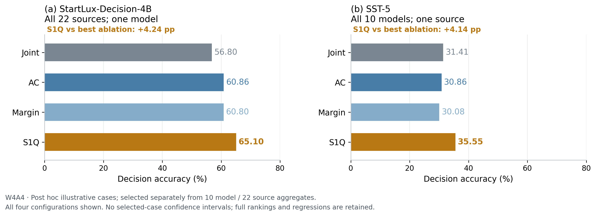

# Post hoc illustrative component cases

Post hoc: separately among all 10 single-model aggregates and all 22 single-source aggregates, require S1Q to exceed all three ablations, then maximize S1Q minus max(Joint, AC, Margin); break exact ties by case_id.

These examples supplement the full **10 models × 22 sources W4A4** quartet; they do not replace it. The rule was chosen after viewing the results. There are no selected-case confidence intervals or significance claims. All four configurations, all 32 candidate rankings and the selected cases' negative cells are retained. No new model evaluation was performed.

| Case / complete scope | Joint | AC | Margin | S1Q | S1Q − best ablation (pp) |
| --- | ---: | ---: | ---: | ---: | ---: |
| StartLux-Decision-4B, all 22 sources | 56.80 | 60.86 | 60.80 | **65.10** | **+4.24** |
| SST-5, all 10 models | 31.41 | 30.86 | 30.08 | **35.55** | **+4.14** |



[PDF](case_studies.pdf) · [SVG](case_studies.svg) · [Standalone TikZ](case_studies.tikz.tex) · [Selected values](selected_cases.csv) · [All 32 candidate ranks](candidate_rankings.csv) · [Single-model complete breakdown](single_model_complete_breakdown.csv) · [Single-source complete breakdown](single_source_complete_breakdown.csv) · [Manifest](figure_manifest.json)

Accuracy is a percentage; differences are percentage points. Model cases average all 22 source accuracies equally; source cases average all 10 model accuracies equally. No source-size weighting or isolated model-by-source extreme-cell selection is used.

StartLux-Decision-4B has 2,871 decisions per method. Its published source cluster counts sum to 2,469, which is not a globally unique independent-cluster count. SST-5 reuses the same 128 source inputs across all 10 models; 1,280 model-decision evaluations are not 1,280 independent examples.

Joint and Margin evaluate 22 candidates per layer; AC and S1Q evaluate 44. The S1Q-versus-AC comparison matches candidate count, but S1Q also incurs margin backpropagation cost. This is not an equal-total-compute causal isolation or a proof of component synergy. These are floating-point QDQ accuracy measurements, with no new packed-checkpoint or integer-kernel speedup claim.

The gain pattern is descriptive. These aggregates do not establish why a particular source benefits, nor a universal winner. See the [whole-matrix component analysis](../components-20261008/README.md) for primary evidence.

Reproduce from repository root (choose a fresh output directory):

```sh
python scripts/build_component_cases.py --source-root results/benchmarks/expanded-20261007 --output-dir work/component-cases
```

## Complete candidate rankings

### All 10 single-model candidates

| Rank | Candidate | Joint | AC | Margin | S1Q | Gap to best (pp) |
| ---: | --- | ---: | ---: | ---: | ---: | ---: |
| 1 | startlux-decision-4b | 56.80 | 60.86 | 60.80 | **65.10** | +4.24 |
| 2 | intern-decision-2b | 39.19 | 41.80 | 42.24 | **44.29** | +2.05 |
| 3 | kev-4b | 63.73 | 62.99 | 62.53 | **65.10** | +1.38 |
| 4 | intern-decision-4b | 46.33 | **51.22** | 48.68 | 51.17 | -0.05 |
| 5 | kev-0.8b | **56.63** | 54.26 | 55.98 | 56.41 | -0.22 |
| 6 | intern-decision-0.8b | **38.68** | 36.80 | 37.35 | 37.89 | -0.79 |
| 7 | kev-9b | 62.06 | **65.95** | 60.00 | 64.90 | -1.05 |
| 8 | startlux-decision-0.8b | 52.28 | **53.19** | 51.38 | 51.76 | -1.42 |
| 9 | laya | 52.50 | 52.17 | **53.94** | 52.51 | -1.43 |
| 10 | startlux-decision-2b | **53.41** | 52.75 | 53.23 | 51.95 | -1.46 |

### All 22 single-source candidates

| Rank | Candidate | Joint | AC | Margin | S1Q | Gap to best (pp) |
| ---: | --- | ---: | ---: | ---: | ---: | ---: |
| 1 | sst5 | 31.41 | 30.86 | 30.08 | **35.55** | +4.14 |
| 2 | csqa | 33.75 | 36.02 | 35.86 | **39.77** | +3.75 |
| 3 | wildjailbreak | 30.23 | 32.19 | 32.58 | **36.25** | +3.67 |
| 4 | emotion | 47.75 | 46.17 | 47.75 | **49.08** | +1.33 |
| 5 | agnews | 72.17 | 73.25 | 74.39 | **75.64** | +1.25 |
| 6 | toolace | 72.35 | 73.24 | 72.06 | **74.41** | +1.18 |
| 7 | trec | 51.16 | 51.90 | 50.66 | **52.98** | +1.07 |
| 8 | mnli | 49.18 | 49.84 | 48.28 | **50.90** | +1.07 |
| 9 | yelp | 54.77 | 56.14 | 54.32 | **56.74** | +0.61 |
| 10 | paws | 53.67 | 55.47 | 53.98 | **56.02** | +0.55 |
| 11 | tweet-offensive | 67.58 | 71.17 | 70.08 | **71.56** | +0.39 |
| 12 | arc | 36.80 | 39.30 | 38.28 | **39.61** | +0.31 |
| 13 | qnli | 59.06 | 60.55 | 61.48 | **61.56** | +0.08 |
| 14 | openbookqa | 31.64 | **33.98** | 33.28 | 33.83 | -0.16 |
| 15 | amazon | **35.00** | 34.45 | 34.30 | 34.69 | -0.31 |
| 16 | boolq | **58.17** | 56.58 | 56.83 | 57.83 | -0.33 |
| 17 | imdb | 74.53 | **74.91** | 74.72 | 74.34 | -0.57 |
| 18 | jevbench | 84.17 | **87.50** | 84.38 | 86.88 | -0.62 |
| 19 | wanli | **44.80** | 43.20 | 44.61 | 44.14 | -0.66 |
| 20 | semif | 53.12 | **54.92** | 52.58 | 53.67 | -1.25 |
| 21 | sciq | 76.52 | **79.67** | 76.20 | 76.96 | -2.72 |
| 22 | mmlu | 29.70 | 29.09 | **30.81** | 27.98 | -2.83 |
