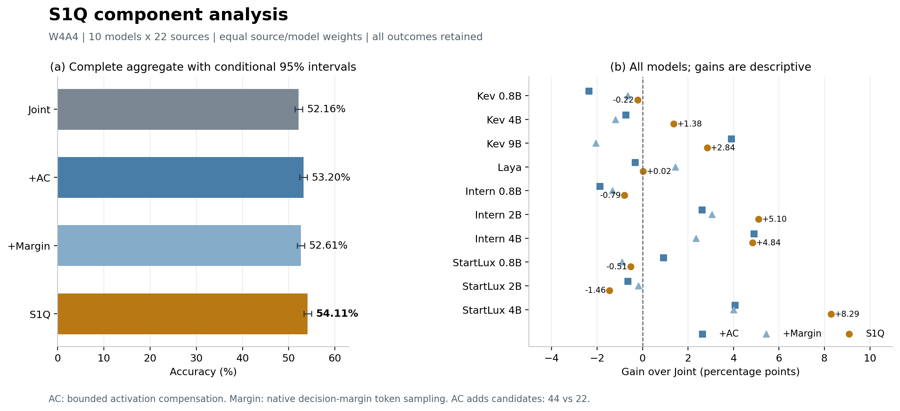
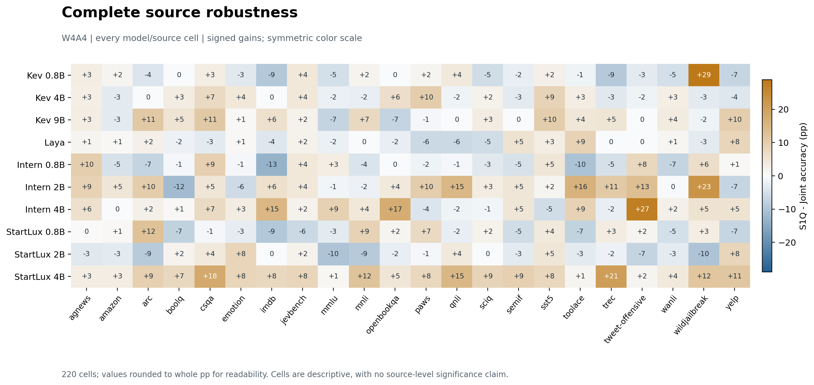
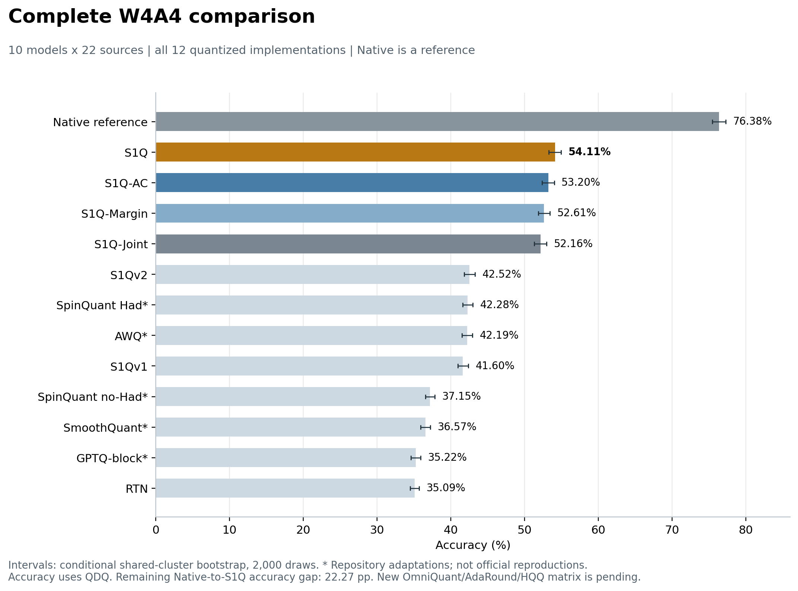

# Complete S1Q component analysis

W4A4; all 10 fixed models and all 22 source suites. Sources are averaged equally within models, then models equally. No favorable model or source subset is selected.

| Model | Configuration | Margin | AC | Candidates/layer | Accuracy % | Gain vs Joint (pp) |
| --- | --- | ---: | ---: | ---: | ---: | ---: |
| kev-0.8b | Joint | 0 | 0 | 22 | **56.63** | +0.00 |
| kev-0.8b | +AC | 0 | 1 | 44 | 54.26 | -2.37 |
| kev-0.8b | +Margin | 1 | 0 | 22 | 55.98 | -0.65 |
| kev-0.8b | S1Q | 1 | 1 | 44 | 56.41 | -0.22 |
| kev-4b | Joint | 0 | 0 | 22 | 63.73 | +0.00 |
| kev-4b | +AC | 0 | 1 | 44 | 62.99 | -0.73 |
| kev-4b | +Margin | 1 | 0 | 22 | 62.53 | -1.20 |
| kev-4b | S1Q | 1 | 1 | 44 | **65.10** | +1.38 |
| kev-9b | Joint | 0 | 0 | 22 | 62.06 | +0.00 |
| kev-9b | +AC | 0 | 1 | 44 | **65.95** | +3.89 |
| kev-9b | +Margin | 1 | 0 | 22 | 60.00 | -2.06 |
| kev-9b | S1Q | 1 | 1 | 44 | 64.90 | +2.84 |
| laya | Joint | 0 | 0 | 22 | 52.50 | +0.00 |
| laya | +AC | 0 | 1 | 44 | 52.17 | -0.33 |
| laya | +Margin | 1 | 0 | 22 | **53.94** | +1.45 |
| laya | S1Q | 1 | 1 | 44 | 52.51 | +0.02 |
| intern-decision-0.8b | Joint | 0 | 0 | 22 | **38.68** | +0.00 |
| intern-decision-0.8b | +AC | 0 | 1 | 44 | 36.80 | -1.88 |
| intern-decision-0.8b | +Margin | 1 | 0 | 22 | 37.35 | -1.33 |
| intern-decision-0.8b | S1Q | 1 | 1 | 44 | 37.89 | -0.79 |
| intern-decision-2b | Joint | 0 | 0 | 22 | 39.19 | +0.00 |
| intern-decision-2b | +AC | 0 | 1 | 44 | 41.80 | +2.61 |
| intern-decision-2b | +Margin | 1 | 0 | 22 | 42.24 | +3.05 |
| intern-decision-2b | S1Q | 1 | 1 | 44 | **44.29** | +5.10 |
| intern-decision-4b | Joint | 0 | 0 | 22 | 46.33 | +0.00 |
| intern-decision-4b | +AC | 0 | 1 | 44 | **51.22** | +4.89 |
| intern-decision-4b | +Margin | 1 | 0 | 22 | 48.68 | +2.35 |
| intern-decision-4b | S1Q | 1 | 1 | 44 | 51.17 | +4.84 |
| startlux-decision-0.8b | Joint | 0 | 0 | 22 | 52.28 | +0.00 |
| startlux-decision-0.8b | +AC | 0 | 1 | 44 | **53.19** | +0.91 |
| startlux-decision-0.8b | +Margin | 1 | 0 | 22 | 51.38 | -0.90 |
| startlux-decision-0.8b | S1Q | 1 | 1 | 44 | 51.76 | -0.51 |
| startlux-decision-2b | Joint | 0 | 0 | 22 | **53.41** | +0.00 |
| startlux-decision-2b | +AC | 0 | 1 | 44 | 52.75 | -0.66 |
| startlux-decision-2b | +Margin | 1 | 0 | 22 | 53.23 | -0.18 |
| startlux-decision-2b | S1Q | 1 | 1 | 44 | 51.95 | -1.46 |
| startlux-decision-4b | Joint | 0 | 0 | 22 | 56.80 | +0.00 |
| startlux-decision-4b | +AC | 0 | 1 | 44 | 60.86 | +4.05 |
| startlux-decision-4b | +Margin | 1 | 0 | 22 | 60.80 | +4.00 |
| startlux-decision-4b | S1Q | 1 | 1 | 44 | **65.10** | +8.29 |
| All | Joint | 0 | 0 | 22 | 52.16 | +0.00 |
| All | +AC | 0 | 1 | 44 | 53.20 | +1.04 |
| All | +Margin | 1 | 0 | 22 | 52.61 | +0.45 |
| All | S1Q | 1 | 1 | 44 | **54.11** | +1.95 |

Bold denotes the best displayed value within a model, including rounding ties; it is not a significance claim. All configurations share W/A reconstruction, layer scope and 128 calibration requests with 128 token rows/layer (64 fit, 64 selection). Enabling AC adds corrected candidates: 44 versus 22. This is a component/recipe comparison, not an equal-compute causal isolation.

Conditional paired 95% intervals are reused unchanged from the frozen shared-cluster bootstrap (2,000 draws, seed 20261007). Models and sources are fixed; no multiple-comparison adjustment. Model gains and source cells have no newly computed intervals. The interaction is a descriptive finite difference, not a synergy test.

S1Q exceeds Joint on 6/10 model averages; all negative outcomes are retained. S1Q-AC has better overall NLL. External quantizers are repository adaptations; the current study uses floating-point QDQ and makes no integer-kernel speedup claim.

